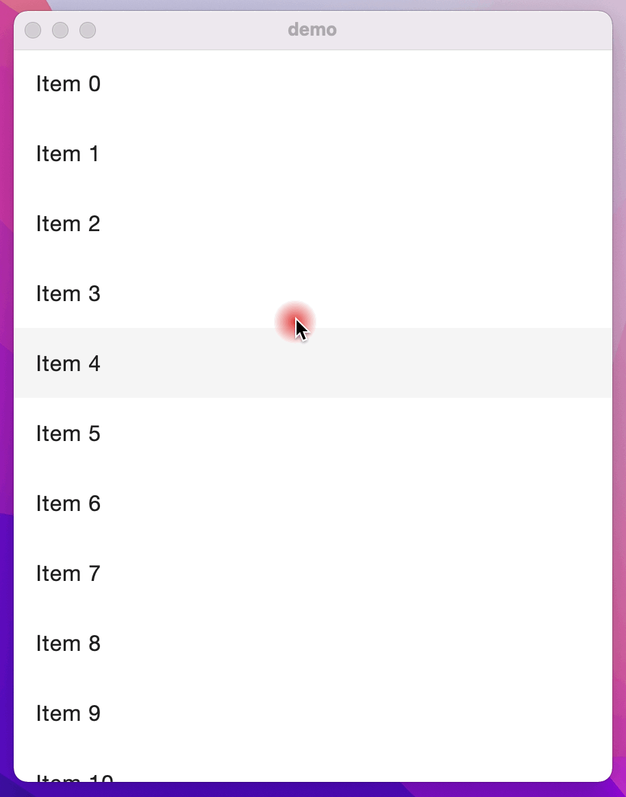

# 学习使用 Decompose 进行组件之间的导航

1. 认真了解 Decompose 文档的内容；
2. 父项目下添加三个子模块 navigator、screens、desktop，settings.gradle.kts文件添加一下内容：

```kotlin
include(
    ":navigator",
    ":screens",
    ":desktop"
)
```

- navigator 模块包含共享的组件导航逻辑代码
- screens 模块包含UI界面代码
- desktop 模块包含特殊平台的程序代码（这里是desktop桌面代码）

3. navigator 模块介绍

- build.gradle.kts 文件添加一下内容

```kotlin
plugins {
    // kotlin-multiplatform 多平台插件
    id("org.jetbrains.kotlin.multiplatform") version "1.6.10"
    // jetbrains-compose 插件，注意这个版本要和kotlin编译版本统一
    id("org.jetbrains.compose") version "1.1.0"
}

kotlin {
    jvm()

    sourceSets {
        commonMain {
            dependencies {
                implementation(compose.runtime)
                implementation(compose.foundation)
                // 安装decompose主模块
                api("com.arkivanov.decompose:decompose:0.6.0")
                // 安装decompose 针对jetbrains compose 的独立扩展模块
                api("com.arkivanov.decompose:extensions-compose-jetbrains:0.6.0")
            }
        }
    }
}
```

- Navigator.kt 文件添加核心导航逻辑代码

4. 大致流程

```kotlin
/**
 * 组件配置-密封类
 * Router 使用配置来检查哪些组件应该是活动的，哪些应该被销毁。在客户端，配置允许您使用适当的输入参数来实例化组件。
 * */
sealed class Screen : Parcelable {

    @Parcelize
    object List : Screen()

    @Parcelize
    data class Details(val text: String) : Screen()
}
```

```kotlin
/**
 * 主页面UI
 * */
@Composable
fun Main() {
    // 1 在开始Compose之前，创建root ComponentContext
    // 2 定义路由的初始配置、返回按钮处理逻辑等
    val router = rememberRouter<Screen>(
        initialConfiguration = { Screen.List },
        handleBackButton = true
    )

    // 3 在 Composable UI 子组件之间导航
    //   Router 提供 RouterState 作为 Value<RouterState> ，可以在 Composable 组件中观察到。这使得跟随 Router 切换 child Composable 组件成为可能。
    Children(
        routerState = router.state,
        animation = childAnimation(fade() + scale())
    ) { screen ->
        when (val configuration = screen.configuration) {
            is Screen.List -> List(onItemClick = { router.push(Screen.Details(text = it)) })
            is Screen.Details -> Details(text = configuration.text, onBack = router::pop)
        }
    }
}
```

5. demo效果


