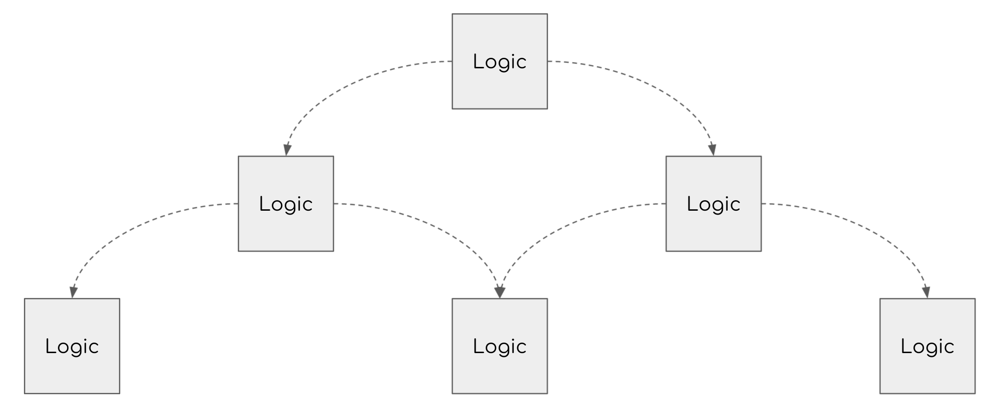
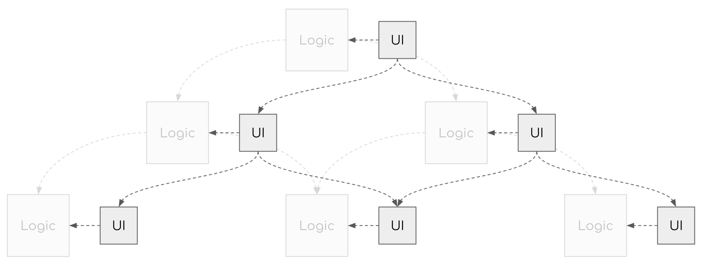
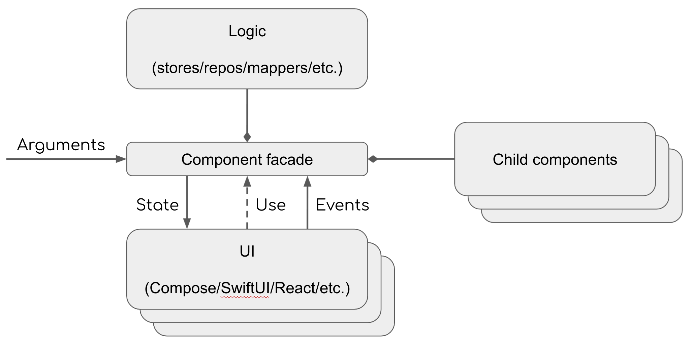

# Component Overview 组件概述

组件只是一个普通的类，它封装了一些逻辑，可能还有另一个（子）组件。每个组件都有自己的生命周期，由 Decompose 自动管理。 因此，组件封装的所有内容都是作用域的。请前往 [Lifecycle 文档页面](2-lifecycle.md)
了解更多信息。

UI 是可选的，可以从组件外部插入。组件不依赖于 UI，而 UI 依赖于组件。

Component 组件的层次结构



可插拔 UI 的层次结构



典型的组件架构



## 1. ComponentContext 组件上下文

每个组件都有一个关联的 ComponentContext，它实现了以下接口：

- `LifecycleOwner`，由 Essenty 库提供，因此每个组件都有自己的生命周期
- `StateKeeperOwner`，由 Essenty 库提供，因此您可以在配置更改和/或进程死亡期间保留任何状态
- `InstanceKeeperOwner`，由 Essenty 库提供，因此您可以在组件中保留任意对象实例（例如使用 AndroidX ViewModels）
- `BackPressedDispatcherOwner`，由 Essenty 库提供，因此每个组件都可以处理返回按钮事件

因此，如果组件需要上述任何功能，只需通过组件的构造函数传递 `ComponentContext` 即可。您可以使用委托模式将 `ComponentContext` 添加到 `this` scope：

```kotlin
class Counter(
    componentContext: ComponentContext
) : ComponentContext by componentContext {

    // The rest of the code
}
```

## 2.1 Root ComponentContext 根组件上下文

实例化根组件时，应手动创建 `ComponentContext`
。 [DefaultComponentContext](https://github.com/arkivanov/Decompose/blob/master/decompose/src/commonMain/kotlin/com/arkivanov/decompose/DefaultComponentContext.kt)
是 `ComponentContext` 的默认实现类。

### 2.1 Android 中的 Root ComponentContext

Decompose
提供了一些方便的 [helper 函数](https://github.com/arkivanov/Decompose/blob/master/decompose/src/androidMain/kotlin/com/arkivanov/decompose/DefaultComponentContextBuilder.kt)
，用于在 Android 中创建 Root ComponentContext。首选方法是在 Activity 或 Fragment 中创建 Root ComponentContext。

#### Activity 中的 Root ComponentContext

对于这种情况，Decompose 提供了 defaultComponentContext() 扩展函数，可以在 Activity 范围内调用。

#### Fragment 中的 Root ComponentContext

不能在 Fragment 中使用 `defaultComponentContext()` 扩展函数。这是因为 Fragment 类没有实现 `OnBackPressedDispatcherOwner`
接口，因此默认无法处理返回按钮事件。建议使用 Android
特定的 `DefaultComponentContext(AndroidLifecycle, SavedStateRegistry?, ViewModelStore?, OnBackPressedDispatcher?)`
工厂函数，并手动提供所有参数。前三个参数`(AndroidLifecycle、SavedStateRegistry 和 ViewModelStore)`可以直接从 Fragment
获取。然而，最后一个论点 `OnBackPressedDispatcher` - 可以不传。如果您不需要处理 Decompose 组件中的后退按钮事件，则可以忽略此参数。否则，需要手动解决方案。

> 不要从托管 Activity 中获取任何参数值（例如 requireActivity().onBackPressedDispatcher），因为它可能会产生内存泄漏。

这是在 `DialogFragment` 中使用 Decompose 的示例。

```kotlin
class MyFragment : DialogFragment() {
    // Create custom OnBackPressedDispatcher
    private val onBackPressedDispatcher = OnBackPressedDispatcher(::dismiss)

    private lateinit var root: Root

    override fun onCreate(savedInstanceState: Bundle?) {
        super.onCreate(savedInstanceState)

        root =
            Root(
                DefaultComponentContext(
                    lifecycle = lifecycle,
                    savedStateRegistry = savedStateRegistry,
                    viewModelStore = viewModelStore,
                    onBackPressedDispatcher = onBackPressedDispatcher,
                )
            )
    }

    override fun onCreateDialog(savedInstanceState: Bundle?): Dialog =
        object : Dialog(requireContext(), theme) {
            override fun onBackPressed() {
                onBackPressedDispatcher.onBackPressed()
            }
        }

    override fun onCreateView(inflater: LayoutInflater, container: ViewGroup?, savedInstanceState: Bundle?): View =
    // Start Compose here
}

```

### 2.2 Jetpack/JetBrains Compose 中的 Root ComponentContext

建议不要直接在 `Composable` 函数中创建 Root `ComponentContext`（和根组件）。组合可以在后台线程中执行，这可能是会被阻止事情。首选方法是在 Compose 之外创建根组件。

> 如果您无法避免在 `Composable` 函数中创建根组件，请确保使用 `remember`。这将防止在每个组合上重新创建根组件及其 `ComponentContext` 。

#### Android 使用 Compose

最好在开始 Compose 之前创建 Root `ComponentContext`（和根组件），例如在 Activity 或 Fragment 中。

```kotlin
class MainActivity : AppCompatActivity() {
    override fun onCreate(savedInstanceState: Bundle?) {
        super.onCreate(savedInstanceState)

        // Create the root component before starting Compose
        // 在开始 Compose 之前，创建 root 组件
        val root = RootComponent(componentContext = defaultComponentContext())

        // Start Compose
        // 开始 compose
        setContent {
            // The rest of the code
            // 其余代码
        }
    }
}

```

#### 其他平台使用 Compose

最好在开始 Compose 之前创建根 `ComponentContext`（和根组件），例如直接在main函数中。

```kotlin
fun main() {
    // Create the root component before starting Compose
    val root = RootComponent(componentContext = DefaultComponentContext(...))

    // Start Compose
    application {
        // The rest of the code
    }
}
```

## 3. Child Component 子组件

Decompose 提供了将组件组织成树的能力，因此每个父组件只知道它的直接子组件。因此库的名称 "Decompose"。您通过多个独立的可重用组件分解您的项目。 将子树添加到另一个地方（重用）时，您只需要满足其顶部组件的依赖关系即可。

添加 child 子组件有两种常见的方法：

- 使用 `Router` 当需要在组件之间导航时首选此选项。请前往 [Router文档页面]() 了解更多信息。
- 手动 如果您需要添加永久子组件或手动控制其生命周期，请首选此选项。

### 3.1 手动添加子组件

为了手动添加子组件，您需要为其创建一个单独的 child `ComponentContext`
。该库提供了 `ComponentContext.childContext(key: String, lifecycle: Lifecycle? = null)`
扩展函数，它创建一个新的 `ComponentContext` 实例并将其附加到父实例。这个函数有两个参数：

- `key` 子 ComponentContext 的 key，在父 ComponentContext 中必须是唯一的
- `lifecycle` 子 ComponentContext 的 `Lifecycle` 是可选的，如果子组件需要提前销毁，或者需要手动控制，可以使用。如果提供，则适用以下条件：
    - 子组件的最终生命周期将尊重父生命周期和提供的生命周期
    - 当提供的 `Lifecycle` 被显式销毁时，子 ComponentContext 将与其父级分离

以下是创建永久子组件的示例：

```kotlin
class SomeParent(
    componentContext: ComponentContext
) : ComponentContext by componentContext {

    private val counter: Counter = Counter(childContext(key = "Counter"))
}
```

以下是使用手动生命周期创建子组件的示例：

```kotlin
class SomeParent(
    componentContext: ComponentContext
) : ComponentContext by componentContext {

    private var counterHolder: CounterHolder? = null

    fun createCounter() {
        val lifecycle = LifecycleRegistry()
        val counter = Counter(childContext(key = "Counter", lifecycle = lifecycle))
        lifecycle.resume()
        counterHolder = CounterHolder(counter, lifecycle)
    }

    fun destroyCounter() {
        counterHolder?.lifecycle?.destroy()
        counterHolder = null
    }

    private class CounterHolder(
        val counter: Counter,
        val lifecycle: LifecycleRegistry,
    )
}
```

> 永远不要将父级的 ComponentContext 传递给子级，始终使用 Router 或 childContext(...) 函数。

## 4. 例子

### 4.1 最简单的组件示例

下面是一个简单的 Counter 组件示例：

```kotlin
class Counter {
    private val _value = MutableValue(State())
    val state: Value<State> = _value

    fun increment() {
        _value.reduce { it.copy(count = it.count + 1) }
    }

    data class State(val count: Int = 0)
}
```

### 4.2 Jetpack/JetBrains Compose UI 示例:

```kotlin
@Composable
fun CounterUi(counter: Counter) {
    val state by counter.state.subscribeAsState()

    Column {
        Text(text = state.count.toString())

        Button(onClick = counter::increment) {
            Text("Increment")
        }
    }
}
```

[Value](https://github.com/arkivanov/Decompose/blob/master/decompose/src/commonMain/kotlin/com/arkivanov/decompose/value/Value.kt)
是多平台一种暴露状态流的方式。它包含 `value` 属性，该属性始终返回当前状态。它还提供了通过 `subscribe/unsubscribe` 方法观察状态变化的能力。
`MutableValue` 是 `Value` 的可变的一种变体。

如果您仅使用 Jetpack/JetBrains Compose UI，那么您很可能可以直接使用其 State 和 MutableState，而无需 Decompose 中的中间 `Value/MutableValue` 。您可以使用
[Compose 扩展模块](https://arkivanov.github.io/Decompose/extensions/compose/) 之一在 `State` 和 `Value` 之间进行转换。

### 4.3 SwiftUI 示例：

```swift
struct CounterView: View {
    private let counter: Counter
    @ObservedObject
    private var state: ObservableValue<CounterState>

    init(_ counter: Counter) {
        self.counter = counter
        self.state = ObservableValue(counter.state)
    }

    var body: some View {
        VStack(spacing: 8) {
            Text(self.state.value.text)
            Button(action: self.counter.increment, label: { Text("Increment") })
        }
    }
}

```