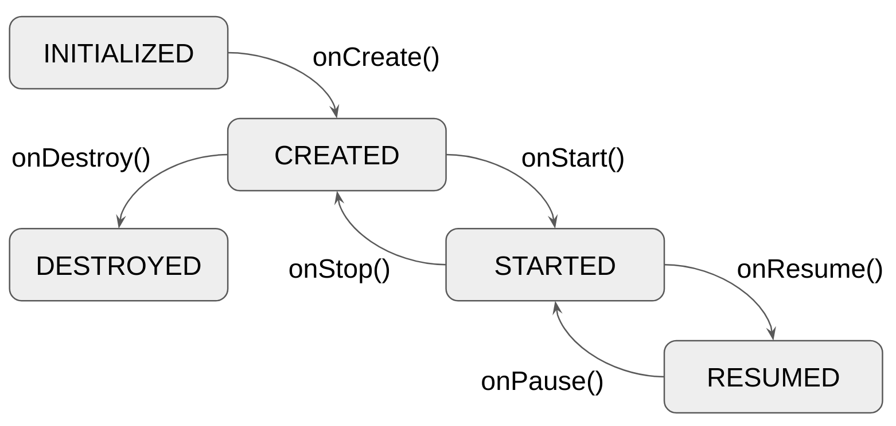

# Lifecycle 生命周期

组件生命周期与 [Android Activity 生命周期](https://developer.android.com/guide/components/activities/activity-lifecycle) 非常相似。
`ComponentContext` 接口扩展了 `LifecycleOwner` 接口，它提供了
Lifecycle——生命周期状态和事件的多平台抽象。它由 [Essenty](https://github.com/arkivanov/Essenty) 库（来自同一作者）提供。

`decompose` 模块将 `Essenty` 的生命周期模块添加为 `api` 依赖项，因此您无需将其显式添加到您的项目中。**请熟悉 Essenty 库**，尤其是 `Lifecycle` 。

每个组件都有自己的生命周期。子组件的生命周期不能长于其父组件的生命周期。



## 使用示例

```kotlin
import com.arkivanov.decompose.ComponentContext
import com.arkivanov.essenty.lifecycle.Lifecycle
import com.arkivanov.essenty.lifecycle.doOnCreate
import com.arkivanov.essenty.lifecycle.subscribe

class SomeComponent(
    componentContext: ComponentContext
) : ComponentContext by componentContext {

    init {
        lifecycle.subscribe(
            object : Lifecycle.Callbacks {
                override fun onCreate() {
                    /* Component created */
                }

                // onStart, onResume, onPause, onStop, onDestroy
            }
        )

        lifecycle.subscribe(
            onCreate = { /* Component created */ },
            // onStart, onResume, onPause, onStop, onDestroy
        )

        lifecycle.doOnCreate { /* Component created */ }
        // doOnStart, doOnResume, doOnPause, doOnStop, doOnDestroy
    }
}
```