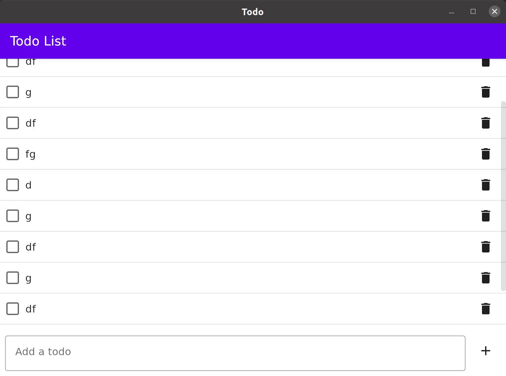
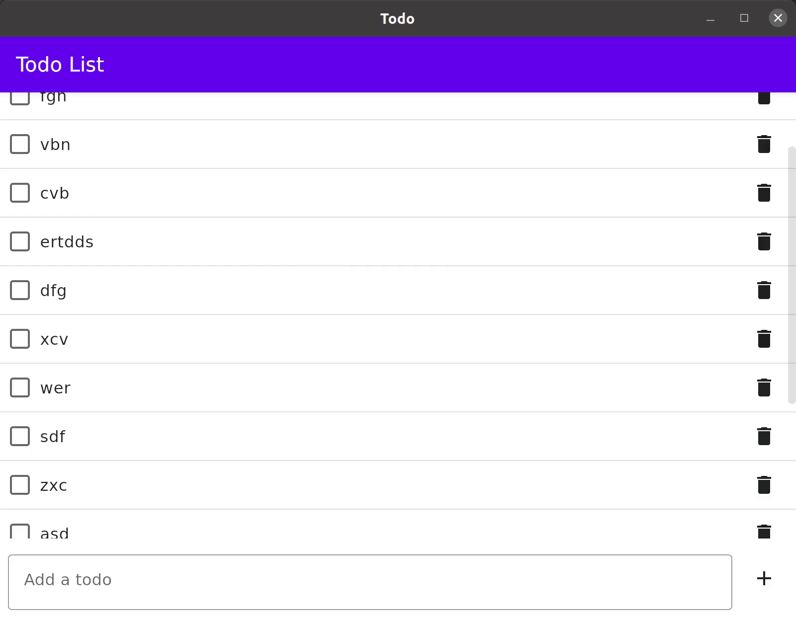
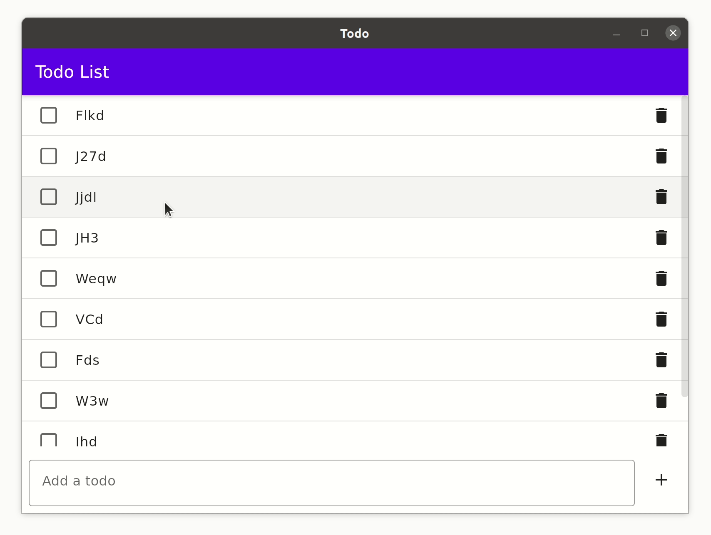

# Extensions for Jetpack/JetBrains Compose

扩展和实用程序，可更轻松地将 Decompose 与 Jetpack/JetBrains Compose 集成。

## 设置

由于 Jetpack 和 JetBrains Compose 分别发布到不同的存储库中，因此 Decompose 为每个变体提供了单独的模块。两个模块都提供类似的功能，但您需要根据使用的 Compose 变体选择相应的模块。

### Jetpack Compose 的扩展设置

Jetpack Compose 的扩展由 extensions-compose-jetpack 模块提供。

groovy

```groovy
implementation "com.arkivanov.decompose:extensions-compose-jetpack:<version>"
```

kotlin

```kotlin
implementation("com.arkivanov.decompose:extensions-compose-jetpack:<version>")
```

### JetBrains Compose 的扩展设置

JetBrains Compose 的扩展由 extensions-compose-jetbrains 模块提供。

groovy

```groovy
implementation "com.arkivanov.decompose:extensions-compose-jetbrains:<version>"
```

kotlin

```kotlin
implementation("com.arkivanov.decompose:extensions-compose-jetbrains:<version>")
```

## Content 内容

如上所述，两个模块都提供了类似的功能。本文档中的大多数链接都指向 Jetpack 模块，但 JetBrains 模块中通常有一个镜像。

### 将 Value 转换为 State

要将 Decompose `Value` 转换为 Compose `State`，请使用 `Value<T>.subscribeAsState(): State<T>` 扩展函数：

```kotlin
interface SomeComponent {
    val models: Value<Model>

    data class Model(/*...*/)
}

@Composable
fun SomeContent(component: SomeComponent) {
    val models: State<Model> by component.models.subscribeAsState()
}
```

### 在 Composable 组件之间导航

Router
提供 [RouterState](https://github.com/arkivanov/Decompose/blob/master/decompose/src/commonMain/kotlin/com/arkivanov/decompose/router/RouterState.kt)
作为 `Value<RouterState>` ，可以在 `Composable` 组件中观察到。这使得跟随 `Router` 切换 child `Composable` 组件成为可能。

两个 Compose 扩展模块都提供了 `Children(...)` 函数，该函数具有以下特性：

- 它监听 `RouterState` 的变化并使用提供的 slot lambda 显示相应的 child `Composable` 组件。
- 它将组件的 UI 状态（例如滚动位置）保留在后台堆栈中以及配置更改和进程死亡。
- 如果提供了 `animation` 规范，它会在 children 之间制作动画。

这是在导航上切换子组件的示例：

```kotlin
// Root

interface RootComponent {
    val routerState: Value<RouterState<*, Child>>

    sealed class Child {
        data class Main(val component: MainComponent) : Child()
        data class Details(val component: DetailsComponent) : Child()
    }
}

@Composable
fun RootContent(rootComponent: RootComponent) {
    Children(rootComponent.routerState) {
        when (val child = it.instance) {
            is RootComponent.Child.Main -> MainContent(child.component)
            is RootComponent.Child.Details -> DetailsContent(child.component)
        }
    }
}

// Children

interface MainComponent

interface DetailsComponent

@Composable
fun MainContent(profileComponent: MainComponent) {
    // Omitted code
}

@Composable
fun DetailsContent(settingsComponent: DetailsComponent) {
    // Omitted code
}
```

### Animations 动画（实验性）

Decompose 为 Compose
提供了 [Child Animation API](https://github.com/arkivanov/Decompose/tree/master/extensions-compose-jetpack/src/main/java/com/arkivanov/decompose/extensions/compose/jetpack/animation/child)
，以及一些预定义的动画规范。要启用子动画，您需要将动画参数传递给 `Children` 函数。 Decompose 提供了预定义的 animators 。

#### Fade animation

```kotlin
@Composable
fun RootContent(rootComponent: RootComponent) {
    Children(
        routerState = rootComponent.routerState,
        animation = childAnimation(fade())
    ) {
        // Omitted code
    }
}
```



#### Slide animation

```kotlin
@Composable
fun RootContent(rootComponent: RootComponent) {
    Children(
        routerState = rootComponent.routerState,
        animation = childAnimation(slide())
    ) {
        // Omitted code
    }
}
```



#### Combining animators

也可以使用 `plus` 运算符组合 animators。请注意顺序很重要 - 右侧animator在左侧animator之后应用。

```kotlin
@Composable
fun RootContent(rootComponent: RootComponent) {
    Children(
        routerState = rootComponent.routerState,
        animation = childAnimation(fade() + scale())
    ) {
        // Omitted code
    }
}
```


#### Separate animations for children

前面的示例演示了简单的情况，即所有孩子都具有相同的动画。但也可以为孩子指定单独的动画。

```kotlin
@Composable
fun RootContent(rootComponent: RootComponent) {
    Children(
        routerState = rootComponent.routerState,
        animation = childAnimation { child, direction ->
            when (child.instance) {
                is RootComponent.Child.Main -> fade() + scale()
                is RootComponent.Child.Details -> fade() + slide()
            }
        }
    ) {
        // Omitted code
    }
}
```



#### 自定义动画

也可以定义自定义动画。

手动实现 `ChildAnimation`。这是最灵活的低级 API。 animation block 接收当前的 `RouterState` 并使用提供的 `content` 槽为子级设置动画。

```kotlin
@Composable
fun RootContent(rootComponent: RootComponent) {
    Children(
        routerState = rootComponent.routerState,
        animation = someAnimation()
    ) {
        // Omitted code
    }
}

fun <C : Any, T : Any> someAnimation(): ChildAnimation<C, T> =
    ChildAnimation { routerState: RouterState<C, T>,
                     modifier: Modifier,
                     content: @Composable (Child.Created<C, T>) -> Unit ->
        // Render each frame here
    }
```

使用 `childAnimation` 辅助函数并实现 `ChildAnimator`。 `childAnimation` 函数负责跟踪 `RouterState` 的变化。 `ChildAnimator` 只负责在给定方向上操作
`Modifier`，并在最后调用 `onFinished`。

```kotlin
@Composable
fun RootContent(rootComponent: RootComponent) {
    Children(
        routerState = rootComponent.routerState,
        animation = childAnimation(someAnimator())
    ) {
        // Omitted code
    }
}

fun someAnimator(): ChildAnimator =
    ChildAnimator { direction: Direction,
                    onFinished: () -> Unit,
                    content: @Composable (Modifier) -> Unit ->
        // Manipulate the Modifier in the given direction and call onFinished at the end
    }
```

使用 `childAnimation` 和 `childAnimator` 辅助函数。这是最简单但功能较弱的方法。 `childAnimator` 函数负责运行动画。它的block的职责非常有限，使用提供的`factor`
和`direction`渲染当前帧。

```kotlin
@Composable
fun RootContent(rootComponent: RootComponent) {
    Children(
        routerState = rootComponent.routerState,
        animation = childAnimation(someAnimator())
    ) {
        // Omitted code
    }
}

fun someAnimator(): ChildAnimator =
    childAnimator { factor: Float,
                    direction: Direction,
                    content: (Modifier) -> Unit ->
        // Render the current frame
    }
```

请参考预定义的动画器（淡入淡出fade 、幻灯片slide 等）的实现示例。