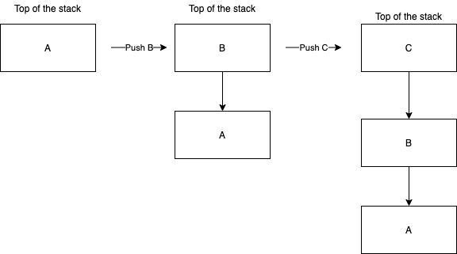
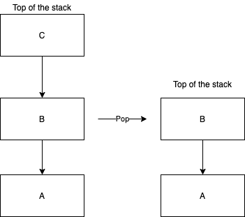
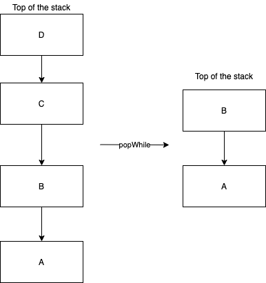
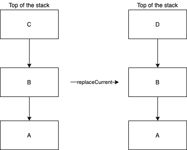
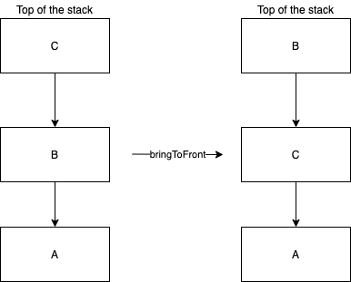

# Navigation 导航

## 路由

Decompose 中的所有导航都是通过 `Router`
接口完成的。有带有两个参数的 `navigate(transformer: (List<C>) -> List<C>, onComplete: (newStack: List<C>, oldStack: List<C>) -> Unit)`
方法：

- `transformer` 将当前的配置堆栈转换为新的。堆栈表示为List，其中最后一个元素是堆栈的顶部，第一个元素是堆栈的底部。
- `onComplete` 导航完成时调用。

为方便起见，还有` navigate(transformer: (stack: List<C>) -> List<C>)` 扩展函数，它是没有 `onComplete` 回调的。

> transformer 函数返回的 configuration stack 配置栈不能为空。

### 导航流程

在导航过程中，`Router` 将新堆栈配置与之前的堆栈配置进行比较。`Router` 确保所有删除的组件都被销毁，并且一次只有一个组件恢复（即最上面的一个）。后台堆栈中的所有组件总是停止或销毁。

`Router` 通常会同步执行导航，这意味着当 `navigate` 方法返回时，导航已经完成，所有组件生命周期都进入了所需的状态。然而，在递归调用的情况下，导航是异步执行的。例如，`pop` 是从被 pushed
组件的 `onResume`
生命周期回调中被调用。一旦当前导航完成，所有递归调用都会排队并一一执行。

## 路由扩展函数

`Router` [扩展函数](https://github.com/arkivanov/Decompose/blob/master/decompose/src/commonMain/kotlin/com/arkivanov/decompose/router/RouterExt.kt)
为导航提供了便利，其中一些已在[路由器概述示例](1-overview.md#路由示例) 中使用。

前面的示例将使用以下 `sealed class` 和 `router` 来展示 `Router` 扩展的用法。

```kotlin
sealed class Configuration {
    object A : Configuration()
    object B : Configuration()
    object C : Configuration()
    object D : Configuration()
}

val router: Router<Configuration>
```

### Push

将提供的 `Configuration` 推送到堆栈顶部。

```kotlin
router.push(Configuration.B)
router.push(Configuration.C)
```



### Pop

弹出堆栈顶部的最新 `Configuration`。

```kotlin
router.pop()

router.pop { isSuccess ->
    // Called when the navigation is finished.
    // isSuccess - `true` if the stack size was greater than 1 and a component was popped, `false` otherwise.
}
```



### Pop while

当提供的谓词返回 true 时，删除堆栈顶部的 `Configuration`。(下图示例中，会删除D，C 两个Configuration，直到谓词为false，则不删除。)

```kotlin
router.popWhile { topOfStack: Configuration -> topOfStack !is B }
```



### Replace Current

用提供的 `Configuration` 替换堆栈顶部的当前 `Configuration`。

```kotlin
router.replaceCurrent(Configuration.D)
```



### Bring to Front

删除所有具有提供的 `Configuration` 类的配置的组件，并将提供的 `Configuration` 添加到堆栈的顶部。
这在实现带有[底部导航](https://github.com/arkivanov/Decompose/discussions/178) 的 Decompose 应用程序时非常有用。

> 该操作作为一个事务执行。如果已经存在具有相同配置的组件，则不会重新创建它。

```kotlin
router.bringToFront(Configuration.B)
```


